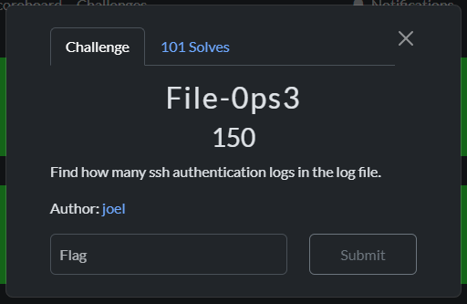

# Linux Basics

- [SSH](#ssh)
- [Commander](#commander)
- [Go Home](#go-home)
- [Ticking Crony](#ticking-crony)
- [Runus](#runus)
- [Strings Operations](#strings-operations)
- [Log Grep](#log-grep)
- [File-0ps1](#file-0ps1)
- [File-0ps2](#file-0ps2)
- [File-0ps3](#file-0ps3)
- [File-0ps4](#file-0ps4)
- [File-0ps5](#file-0ps5)
- [File-0ps6](#file-0ps6)
- [File-0ps7](#file-0ps7)
- [File-0ps8](#file-0ps8)

## SSH


```bash
ssh
```

## Commander


```bash
shell
```

## Go Home


## Ticking Crony


1. Login via ssh

    ```bash
    ssh ctfplayer@52.225.17.38
    ctfplayer@52.225.17.38's password:
    ```

2. Search for recently modified files with 5 minutes

    ```bash
    ctfplayer@CTFDPROD:~$ 'find / -type f -mmin -5 2>/dev/null | grep -v "/proc\|/sys"'
    '/var/ctf_flags/cron_flag.txt'
    /var/log/journal/140608600ddd454c9e8a322679fcfd5d/user-1001.journal
    /var/log/auth.log
    /var/log/lastlog
    /var/log/btmp
    /var/log/wtmp
    /run/motd.dynamic
    /run/utmp

    ctfplayer@CTFDPROD:~$ 'cat /var/ctf_flags/cron_flag.txt'
    'cyberstars{cron_mastery}'
    ```

## Runus


1. Login via ssh

    ```bash
    ssh ctfplayer@52.225.17.38
    ctfplayer@52.225.17.38's password:
    ```

2. List the files in the home directory

    ```bash
    ctfplayer@CTFDPROD:~$ 'ls -la'
    total 2692
    drwxr-x--- 11 ctfplayer ctfplayer    4096 Oct 22 13:41  .
    drwxr-xr-x  4 root      root         4096 Aug 27 19:15  ..
    -r--r--r--  1 root      root            0 Oct  3 09:00  .bash_history
    drwx------  2 ctfplayer ctfplayer    4096 Oct 20 09:01  .cache
    -rw-------  1 ctfplayer ctfplayer      20 Oct 22 13:41  .lesshst
    drwxrwxr-x  3 ctfplayer ctfplayer    4096 Oct 21 11:51  .local
    -rw-------  1 ctfplayer ctfplayer    1187 Oct 21 07:38  .viminfo
    -rw-rw-r--  1 ctfplayer ctfplayer     165 Oct 20 13:10  .wget-hsts
    drwxrwxr-x  2 ctfplayer ctfplayer    4096 Oct 19 21:49  Downloads
    -rwxrwxr-x  1 ctfplayer ctfplayer       0 Oct 17 21:14  bof1
    -rwxrwxr-x  1 ctfplayer ctfplayer      16 Oct 15 11:51  bof1.save
    drwxrwxr-x  2 ctfplayer ctfplayer    4096 Oct 16 07:06  bof_lab
    -rw-rw-r--  1 ctfplayer ctfplayer     131 Oct 14 23:11  cookies.txt
    -rwxrwxr-x  1 ctfplayer ctfplayer    2894 Oct 20 13:08  crack_md4_of_md5.py
    -rw-rw-r--  1 ctfplayer ctfplayer 2666133 Oct 10 09:58 ctf_activity.zip?    token=eyJ1c2VyX2lkIjo0MDksInRlYW1faWQiOm51bGwsImZpbGVfaWQiOjcyfQ.aPX7Xw.MRSa-eFrViolAcb3cFU8y5RNjHU
    -rw-rw-r--  1 ctfplayer ctfplayer      33 Oct 17 12:04  'cyberstars_flag.txt'
    -rwxrwxr-x  1 ctfplayer ctfplayer       0 Oct 17 13:38  exploit_final.bin
    drwxrwxr-x  2 ctfplayer ctfplayer    4096 Oct 20 20:16  file_ops
    -rw-rw-r--  1 ctfplayer ctfplayer      33 Oct 20 21:12  hash.txt
    -rw-rw-r--  1 ctfplayer ctfplayer     276 Oct 14 23:11  login_response.html
    drwxr-xr-x  2 root      root         4096 Oct 10 08:24  logs
    drwxr-xr-x  3 root      root         4096 Oct 10 07:04  logxd
    -rw-rw-r--  1 ctfplayer ctfplayer       0 Oct 20 13:13  md5_hex_list.txt
    -rw-rw-r--  1 ctfplayer ctfplayer       0 Oct 20 13:10  rockyou.txt
    drwxr-xr-x  2 root      root         4096 Oct 10 07:11  runx
    drwxr-xr-x  2 root      root         4096 Oct 10 07:25  strix
    -rwxrwxr-x  1 ctfplayer ctfplayer    2394 Oct 20 13:15  try_crack.py
    -rw-rw-r--  1 ctfplayer ctfplayer       0 Oct 21 19:55  wc
    -rw-rw-r--  1 ctfplayer ctfplayer      46 Oct 20 13:06  wordlist.txt

    ctfplayer@CTFDPROD:~$ 'cat cyberstars_flag.txt'
    'cyberstars{run_s4n1ty_run_4_ucc}'
    ```

## Strings Operations


```bash
ctfplayer@CTFDPROD:~$ 'cd strix/'

ctfplayer@CTFDPROD:~/strix$ 'ls -la'
total 24
drwxr-xr-x  2 root      root       4096 Oct 10 07:25 .
drwxr-x--- 11 ctfplayer ctfplayer  4096 Oct 22 14:38 ..
-rwxr-xr-x  1 root      root      16184 Oct 10 07:24 stringsxd

ctfplayer@CTFDPROD:~/strix$ 'strings stringsxd | grep cyberstars'
'cyberstars{S7r1ng5_m4k3_R3_345y}'
```

## Log Grep


```bash
ctfplayer@CTFDPROD:~$ 'cd /home/ctfplayer/logxd/1/2/3/.4/logstack'

ctfplayer@CTFDPROD:~/logxd/1/2/3/.4/logstack$ 'ls -la'
total 24
drwxr-xr-x 2 root root  4096 Oct 10 07:06 .
drwxr-xr-x 3 root root  4096 Oct 10 07:05 ..
-rw-r--r-- 1 root root 14552 Oct 10 07:06 .logstack

ctfplayer@CTFDPROD:~/logxd/1/2/3/.4/logstack$ 'strings .logstack | grep cyberstars'
'cyberstars{grep_is_good_to_find_things_!!!!!!}'
```

## File-0ps1


### 1. Download the file with `wget`

```bash
$ 'wget https://learn.ug-cert.ug/files/dea010cf35e4916d722c8a17058dc2b5/ctf_activity.zip?token=eyJ1c2VyX2lkIjo0NDIsInRlYW1faWQiOm51bGwsImZpbGVfaWQiOjcyfQ.aPj0jg.A6L7XNf0ZIJCq2fbmSVVCxIWtz0
--2025-10-22 18:14:51--  https://learn.ug-cert.ug/files/dea010cf35e4916d722c8a17058dc2b5/ctf_activity.zip?token=eyJ1c2VyX2lkIjo0NDIsInRlYW1faWQiOm51bGwsImZpbGVfaWQiOjcyfQ.aPj0jg.A6L7XNf0ZIJCq2fbmSVVCxIWtz0'
```

### 2. List files to confirm its downloaded

```bash
$ 'ls -la'
total 2604
drwxrwxrwx 1 root root    4096 Oct 22 18:14  .
drwxrwxrwx 1 root root    4096 Oct 22 17:11  ..
-rwxrwxrwx 1 root root 2666133 Oct 10 12:58 'ctf_activity.zip?token=eyJ1c2VyX2lkIjo0NDIsInRlYW1faWQiOm51bGwsImZpbGVfaWQiOjcyfQ.aPj0jg.A6L7XNf0ZIJCq2fbmSVVCxIWtz0'
```

### 3. Rename the downloaded file, in this case to `ctf_activity.zip`

```bash
$ 'mv ctf_activity.zip\?token\=eyJ1c2VyX2lkIjo0NDIsInRlYW1faWQiOm51bGwsImZpbGVfaWQiOjcyfQ.aPj0jg.A6L7XNf0ZIJCq2fbmSVVCxIWtz0 ctf_activity.zip'
$ 'ls -la'
total 2604
drwxrwxrwx 1 root root    4096 Oct 22 18:17 .
drwxrwxrwx 1 root root    4096 Oct 22 17:11 ..
-rwxrwxrwx 1 root root 2666133 Oct 10 12:58 ctf_activity.zip
```

### 4. Unzip the file

```bash
$ 'unzip ctf_activity.zip'
Archive:  ctf_activity.zip
  inflating: ctf_activity.log
```

### 5. List the files to see the unzipped file

```bash
$ 'ls -la'
total 24156
drwxrwxrwx 1 root root     4096 Oct 22 18:17 .
drwxrwxrwx 1 root root     4096 Oct 22 18:17 ..
-rwxrwxrwx 1 root root 22068680 Oct 10 05:49 'ctf_activity.log'
-rwxrwxrwx 1 root root  2666133 Oct 10 12:58 ctf_activity.zip
```

### 6. `cat` the file and pipe the result into `word count`

```bash
$ 'cat ctf_activity.log | wc -l'
'200000'

'cyberstars{200000}'
```

## File-0ps2


```bash
$ 'grep -E "ERROR|CRIT" ctf_activity.log | wc -l'
'67002'

'cyberstars{67002}'
```

## File-0ps3



```bash
$ 'grep -E auth ctf_activity.log | wc -l'
'72109'

'cyberstars{72109}'
```

## File-0ps4


## File-0ps5


```bash
$ 'grep " 404 " ctf_activity.log | wc -l'
'7554'

'cyberstars{7554}'
```

## File-0ps6


## File-0ps7


```bash
$ 'grep "SELECT \* FROM" ctf_activity.log | awk '{print $0}' | sort | uniq -c | sort -nr | head -1'
1 2025-10-03T14:03:44Z db NOTICE svc_backup 10.10.10.10 "SELECT * FROM secrets WHERE id=7" token=SECRET_TOKEN_42

$ 'grep "SELECT \* FROM" ctf_activity.log | awk '{print $11}' | sort | uniq -c | sort -nr | head -1'
1593 'secrets'

'cyberstars{secrets}'
```

## File-0ps8


```bash
$ 'grep -i "flag" ctf_activity.log'
2025-10-02T09:55:00Z web ERROR alice 203.0.113.7 "GET /admin HTTP/1.1" 403 512 'FLAG{use_grep_and_awk}'
```

[Back to Top](#linux-basics)
